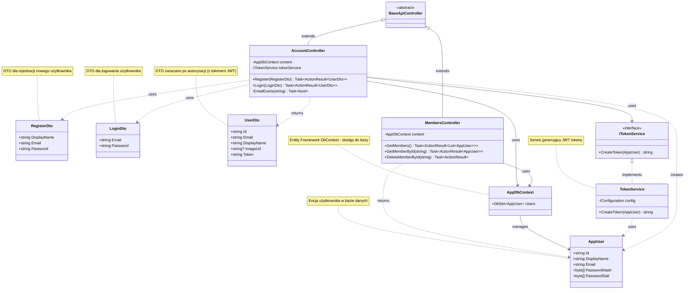

# Diagram klas projektu DatingApp API

## Diagram Mermaid



---

## Legenda

### Typy relacji:
- **`<|--`** - Dziedziczenie (extends)
- **`<|..`** - Implementacja interfejsu (implements)
- **`-->`** - Użycie/Zależność silna (pole w klasie)
- **`..>`** - Użycie/Zależność słaba (parametr metody, zwracany typ)

### Typy klas:
- **Entities** - Modele bazy danych (AppUser)
- **DTOs** - Data Transfer Objects (RegisterDto, LoginDto, UserDto)
- **Controllers** - Endpointy API (AccountController, MembersController)
- **Data** - DbContext (AppDbContext)
- **Services** - Logika biznesowa (TokenService)
- **Interfaces** - Kontrakty (ITokenService)

---

## Opis przepływu danych

### Rejestracja użytkownika
```
RegisterDto → AccountController → AppUser (nowy) → AppDbContext → Baza danych
                    ↓
              TokenService.CreateToken(AppUser) → JWT Token
                    ↓
                UserDto (z tokenem) → Response
```

### Logowanie użytkownika
```
LoginDto → AccountController → AppDbContext.Users → AppUser (pobrany)
                    ↓
           Weryfikacja hasła (HMACSHA512)
                    ↓
           TokenService.CreateToken(AppUser) → JWT Token
                    ↓
           UserDto (z tokenem) → Response
```

### Pobieranie listy członków
```
MembersController → AppDbContext.Users → List<AppUser> → Response
```

### Pobieranie członka po ID
```
MembersController → AppDbContext.Users.FindAsync(id) → AppUser → Response
```

### Usuwanie członka
```
MembersController → AppDbContext.Users.FindAsync(id) → Remove → SaveChangesAsync
```

---

## Struktura projektu

```
API/
├── Controllers/
│   ├── BaseApiController.cs       (Klasa bazowa)
│   ├── AccountController.cs       (Rejestracja, logowanie)
│   └── MembersController.cs       (CRUD użytkowników)
│
├── Entities/
│   └── AppUser.cs                 (Model użytkownika)
│
├── DTOs/
│   ├── RegisterDto.cs             (Dane rejestracji)
│   ├── LoginDto.cs                (Dane logowania)
│   └── UserDto.cs                 (Odpowiedź z tokenem)
│
├── Data/
│   └── AppDbContext.cs            (EF Core DbContext)
│
├── Services/
│   └── TokenService.cs            (Generowanie JWT)
│
└── Interfaces/
    └── ITokenService.cs           (Kontrakt serwisu tokenów)
```

---

## Jak wyświetlić diagram?

### 1. W VS Code
Zainstaluj rozszerzenie: **Markdown Preview Mermaid Support**

### 2. Online
Skopiuj kod Mermaid do: https://mermaid.live/

### 3. GitHub
Diagram automatycznie renderuje się w plikach .md

---

Ostatnia aktualizacja: 15 grudnia 2025
